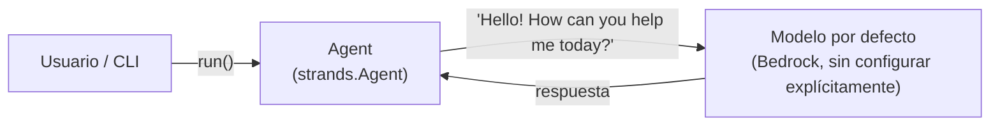

| | |
|:---|---:|
| AWS Community Day Bolivia 2026 | Powered by [Kiro](https://kiro.dev) |

---

# 00 - Proyecto base

## Objetivo

Punto de partida del workshop: el agente Strands más simple posible, sin
modelo configurado explícitamente, sin herramientas, sin persistencia. El
propósito es únicamente confirmar que el entorno (Python vía `uv`, el SDK
`strands-agents`, y `devbox`/`direnv` para el shell) funciona antes de
agregar cualquier capacidad real en los pasos siguientes.

```python
from strands import Agent

agent = Agent(system_prompt="You are a helpful personal assistant.")

def run() -> None:
    agent("Hello! How can you help me today?")
```

## Arquitectura

No aplica en el sentido de componentes distribuidos — es un solo archivo
(`src/proyecto_base/agent.py`). La única decisión relevante en este paso es
el layout de proyecto (`pyproject.toml` + `src/<módulo>/`) que el resto de
los pasos reutiliza.



## Controles de IA y herramientas de apoyo

- **Controles de IA:** ninguno todavía — no hay herramientas que el agente
  pueda invocar, por lo que no hay superficie de riesgo que gatear.
- **Herramientas de apoyo:**
  - Kiro Skill [`scaffold-strands-step`](../00-proyecto-base/.kiro/skills/scaffold-strands-step/SKILL.md) —
    documenta el layout exacto de `pyproject.toml`/`src/` que evita el bug
    de nombre de módulo inválido (directorio con guion en vez de guion
    bajo) que este paso tuvo originalmente.
  - Steering doc [`engineering-practices`](../00-proyecto-base/.kiro/steering/engineering-practices.md) —
    principios de SOLID/TDD/manejo de errores/logging aplicados en este
    repo, cargado siempre en el contexto de Kiro para este paso.

## Cómo aprobar este nivel

📁 Directorio: `00-proyecto-base/`

```bash
uv sync
uv run pytest -v          # 3 tests: run() invoca al agente con el saludo esperado
uv run python -c "from proyecto_base.agent import run; run()"   # opcional: prueba real contra Bedrock
```

Criterio de aprobación: `uv run pytest -v` pasa sin fallos. No requiere
credenciales de AWS ni de Google todavía (el smoke test real contra
Bedrock es opcional, no obligatorio, para pasar este nivel).

