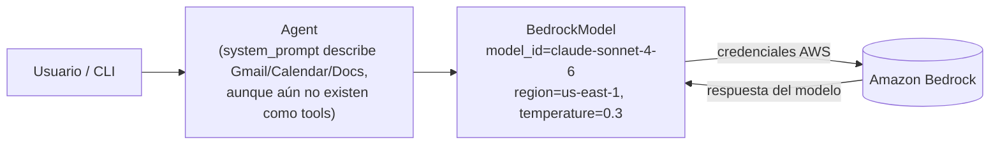

| | |
|:---|---:|
| AWS Community Day Bolivia 2026 | Powered by [Kiro](https://kiro.dev) |

---

# 01 - Agente básico

## Objetivo

Reemplazar el modelo por defecto del paso 00 por un `BedrockModel` explícito
(Claude Sonnet 4.6, `us-east-1`, `temperature=0.3`) y un `system_prompt`
real que describe las capacidades futuras del asistente (Gmail, Calendar,
Docs) — aunque en este paso todavía no existan como herramientas. Es el
primer punto donde el agente realmente depende de credenciales de AWS
(acceso a Bedrock habilitado en la cuenta/región).

## Arquitectura

Sigue siendo un solo archivo (`agent.py`), ahora con la construcción
explícita del modelo:

```python
bedrock_model = BedrockModel(
    model_id="global.anthropic.claude-sonnet-4-6",
    region_name="us-east-1",
    temperature=0.3,
)
agent = Agent(model=bedrock_model, system_prompt=SYSTEM_PROMPT)
```



## Controles de IA y herramientas de apoyo

- **Controles de IA:** ninguno todavía (sigue sin herramientas invocables).
  El `system_prompt` ya redacta la instrucción de "confirmar antes de
  enviar correos o crear eventos", pero es solo texto — no se convierte en
  control real de código hasta el paso 05 (steering/interrupts).
- **Herramientas de apoyo:**
  - Kiro Skill [`wire-bedrock-model`](../01-agente-basico/.kiro/skills/wire-bedrock-model/SKILL.md) —
    checklist para cambiar `model_id`/`region_name`/`temperature` de forma
    consistente con el resto del repo, y para mantener los tests de
    configuración del modelo sincronizados con el código.

## Cómo aprobar este nivel

📁 Directorio: `01-agente-basico/`

Requisito previo: acceso al modelo Claude habilitado en Amazon Bedrock, en
`us-east-1` (o la región que uses), y credenciales de AWS configuradas
(`aws sts get-caller-identity` debe funcionar).

```bash
uv sync
uv run pytest -v          # 3 tests: bedrock_model y agent construidos con los valores esperados, run() invoca el saludo
uv run python -c "from personal_assistant_agent.agent import run; run()"   # smoke test real contra Bedrock
```

Criterio de aprobación: los tests pasan (no requieren AWS, todo mockeado) y
el smoke test real devuelve una respuesta del modelo sin error de
credenciales/acceso.

