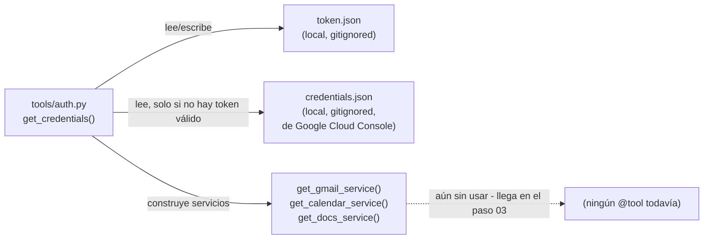
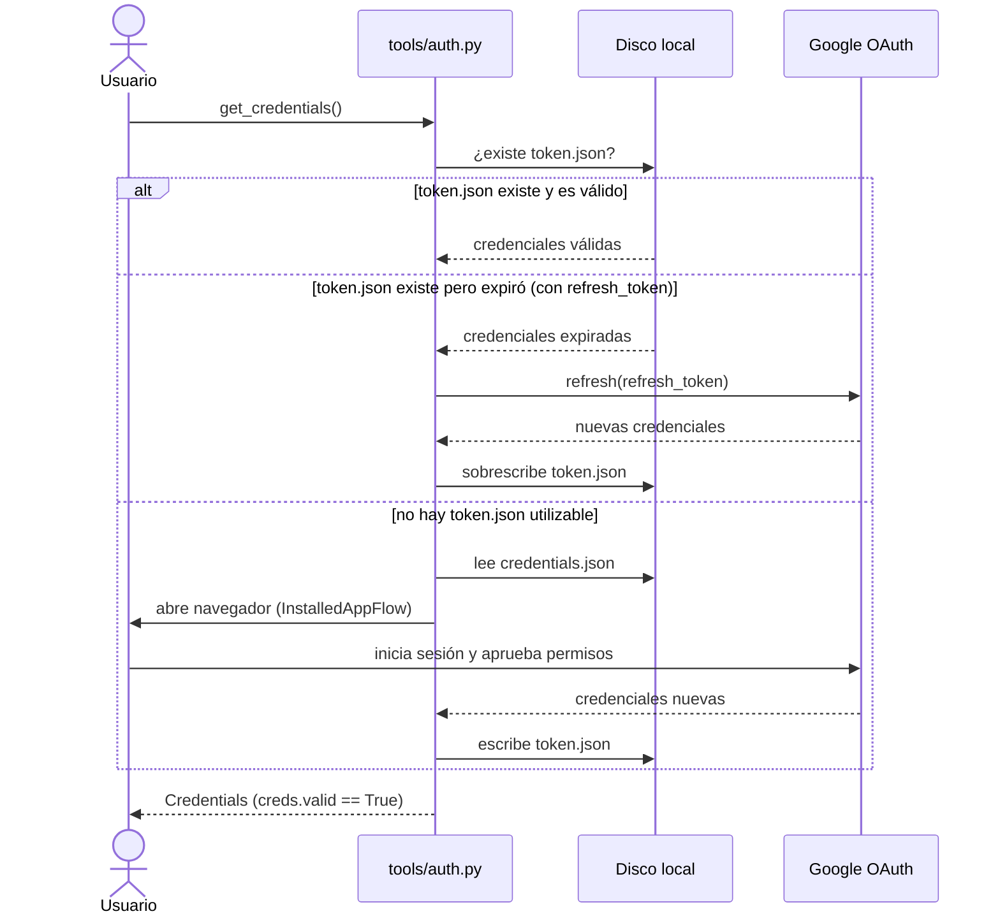

| | |
|:---|---:|
| AWS Community Day Bolivia 2026 | Powered by [Kiro](https://kiro.dev) |

---

# 02 - Configuración de autenticación (Google OAuth)

## Objetivo

Agregar el flujo de autenticación OAuth2 contra Google Workspace
(`tools/auth.py`), sin exponer todavía ninguna herramienta real de
Gmail/Calendar/Docs — este paso es puramente "conseguir un `token.json`
válido" antes de construir herramientas sobre él en el paso 03.

## Arquitectura

Un solo módulo nuevo, `tools/auth.py`:

- `get_credentials()` — carga `token.json` si existe y es válido: lo
  refresca si está vencido (con `refresh_token`), o dispara el flujo de
  consentimiento en navegador (`InstalledAppFlow.run_local_server`) si no
  hay token utilizable, usando `credentials.json` (descargado de Google
  Cloud Console).
- `get_gmail_service()` / `get_calendar_service()` / `get_docs_service()` —
  construyen clientes de la API de Google (`googleapiclient.discovery.build`)
  a partir de las credenciales anteriores. Estas funciones existen ya en
  este paso, aunque ningún `@tool` las use todavía (eso llega en el 03).



El flujo de obtención/renovación del token es el aspecto más relevante de
este paso — es una secuencia con tres posibles caminos según el estado de
`token.json`:



## Controles de IA y herramientas de apoyo

- **Controles de IA:** ninguno todavía — no hay herramientas invocables por
  el agente en este paso, por lo tanto no hay superficie de riesgo. El
  control relevante aquí es de **manejo de secretos**, no de comportamiento
  del agente: `credentials.json` y `token.json` están en `.gitignore` desde
  este paso en adelante y nunca deben commitearse.
- **Herramientas de apoyo:**
  - Kiro Skill [`google-oauth-setup`](../02-agente-email-conf/.kiro/skills/google-oauth-setup/SKILL.md) —
    la guía completa de Google Cloud Console + el flujo de bootstrap local,
    consolidada en un solo lugar en vez de estar duplicada en cinco
    READMEs distintos (02 a 06).
  - `tools/errors.py` (`google_api_call`/`ToolExecutionError`) y
    `AuthenticationError` en `tools/auth.py` — backport del patrón de
    manejo de errores introducido originalmente en el paso 05, para que
    fallos de autenticación produzcan un mensaje claro en vez de una
    traza cruda.

## Cómo aprobar este nivel

📁 Directorio: `02-agente-email-conf/`

Sigue primero la guía completa de configuración en el
[README de este paso](../02-agente-email-conf/README.md) (crear proyecto en
Google Cloud, habilitar APIs, pantalla de consentimiento, credenciales
OAuth tipo Desktop app) — resumida también en la Skill
`google-oauth-setup` mencionada arriba.

```bash
uv sync
uv run pytest -v          # 8 tests: get_credentials() en sus distintas ramas, todo mockeado (sin red real)

# Bootstrap real: coloca credentials.json en la raíz de este paso primero
uv run python -c "
from personal_assistant_agent.tools import auth
creds = auth.get_credentials()
print('Authenticated. Token valid:', creds.valid)
"
```

Criterio de aprobación: los tests pasan, y el comando de bootstrap real
imprime `Authenticated. Token valid: True` y deja un `token.json` válido en
la raíz del proyecto (necesario para el paso 03).

