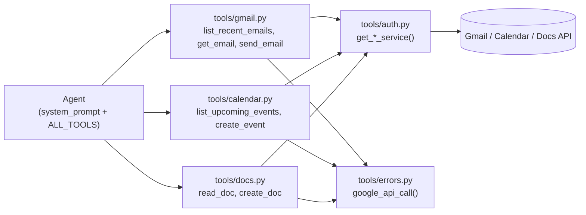
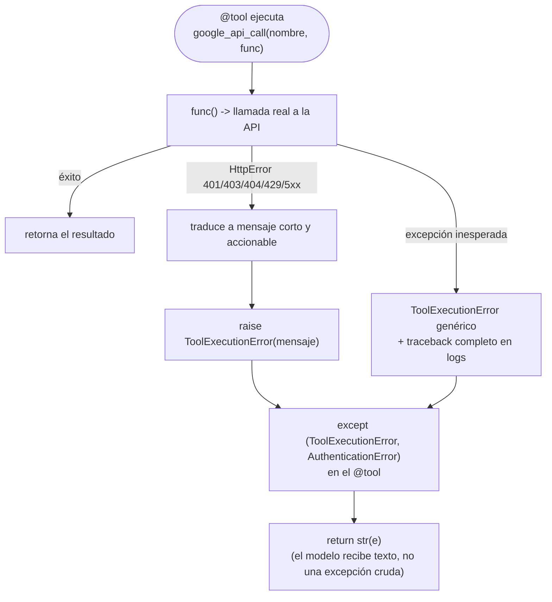

| | |
|:---|---:|
| AWS Community Day Bolivia 2026 | Powered by [Kiro](https://kiro.dev) |

---

# 03 - Implementación de herramientas (Gmail, Calendar, Docs)

## Objetivo

Convertir la autenticación del paso 02 en capacidades reales: exponer
Gmail, Calendar y Docs como herramientas (`@tool`) que el agente puede
invocar directamente. Este es el primer paso donde el agente puede *leer y
escribir* datos reales del usuario (listar/leer correos, enviar correos,
listar/crear eventos, leer/crear documentos).

## Arquitectura

```
tools/
├── auth.py       # del paso 02, sin cambios de comportamiento
├── errors.py     # NUEVO: google_api_call() / ToolExecutionError
├── gmail.py      # list_recent_emails, get_email, send_email
├── calendar.py   # list_upcoming_events, create_event
├── docs.py       # read_doc, create_doc
└── __init__.py   # ALL_TOOLS = [...]
```



`tools/errors.py` centraliza el manejo de errores de la API de Google:
`google_api_call(tool_name, func)` ejecuta la llamada, traduce
`HttpError` (401/403/404/429/5xx) a un mensaje corto y accionable, y
registra el intento/resultado — cada `@tool` llama a la API real *a
través* de este wrapper en vez de hacer `.execute()` directamente.



## Controles de IA y herramientas de apoyo

- **Controles de IA:** ninguno todavía a nivel de confirmación — `send_email`
  y `create_event` ya son invocables sin ningún gate de código en este
  paso (el `system_prompt` pide confirmar, pero nada lo fuerza). Este es
  intencional: los controles reales (steering, interrupts) se introducen
  en el paso 05, una vez que existen las herramientas que hay que
  proteger. Si necesitas ese control antes, mira la Skill
  `add-confirmation-gate` del paso 05.
- **Herramientas de apoyo:**
  - Kiro Skill [`add-google-tool`](../03-agente-impl-tools/.kiro/skills/add-google-tool/SKILL.md) —
    el patrón completo para agregar una nueva herramienta de Gmail/
    Calendar/Docs: wiring de `get_*_service`, envoltura con
    `google_api_call`, registro en `ALL_TOOLS`, y la forma de test
    esperada (mock de `get_*_service`, casos normal + `ToolExecutionError`
    + `AuthenticationError`).

## Cómo aprobar este nivel

📁 Directorio: `03-agente-impl-tools/`

Requisito previo: `token.json`/`credentials.json` válidos del paso 02
(cópialos a este directorio, o repite el flujo de auth aquí).

```bash
uv sync
uv run pytest -v          # 36 tests: cada tool (normal + error), errors.py, todo mockeado
```

Prueba manual opcional contra las APIs reales:
```bash
uv run python -c "
from personal_assistant_agent.agent import agent
print(agent('List my 5 most recent emails.'))
"
```

Criterio de aprobación: `uv run pytest -v` pasa sin fallos (36/36). La
prueba manual es opcional pero recomendada para confirmar que las APIs de
Google están realmente habilitadas y autorizadas de punta a punta.

