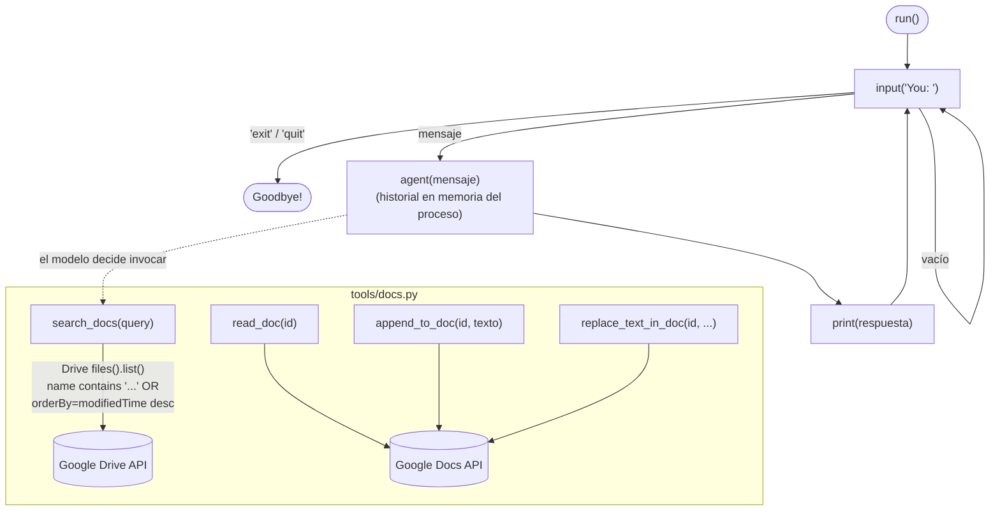

| | |
|:---|---:|
| AWS Community Day Bolivia 2026 | Powered by [Kiro](https://kiro.dev) |

---

# 04 - Implementación de chatbot interactivo

## Objetivo

Convertir el agente de una sola invocación (paso 03) en un chatbot de
terminal con loop interactivo que mantiene el historial de la conversación
en memoria del proceso, y extender Docs con capacidades de búsqueda vía
Google Drive (`search_docs`, `append_to_doc`, `replace_text_in_doc`), para
que el agente pueda encontrar documentos por nombre en vez de requerir el
ID exacto.

## Arquitectura

```
agent.py
  run()  # loop: input() -> agent(mensaje) -> print() -> repetir hasta "exit"/"quit"

tools/docs.py (ampliado)
  search_docs()          # Drive files().list(), busca por nombre o lista recientes
  read_doc() / create_doc()   # del paso 03, sin cambios
  append_to_doc()         # inserta texto al final (calcula end_index del último elemento)
  replace_text_in_doc()    # find/replace vía Docs batchUpdate
```



Nueva dependencia de scope: `drive.readonly` se agrega a `SCOPES` en
`tools/auth.py` — quien ya tenía un `token.json` del paso 02/03 debe
regenerarlo para obtener el permiso de Drive (ver Skill
`google-oauth-setup` del paso 02, sección de scopes).

## Controles de IA y herramientas de apoyo

- **Controles de IA:** aún ninguno a nivel de código — `append_to_doc` y
  `replace_text_in_doc` **modifican** documentos existentes sin
  confirmación forzada (el `system_prompt` lo pide, pero nada lo bloquea
  todavía). El mismo patrón que en el paso 03: el control real llega en
  el paso 05.
- **Herramientas de apoyo:**
  - Kiro Skill [`add-docs-drive-capability`](../04-agente-impl-chatbot/.kiro/skills/add-docs-drive-capability/SKILL.md) —
    cómo agregar una nueva capacidad de Docs respaldada por consultas de
    Drive (`get_drive_service()` en vez de `get_docs_service()`), incluido
    el escape de comillas en el query de Drive y el manejo de la ausencia
    de término de búsqueda (listar los más recientes en vez de fallar).

## Cómo aprobar este nivel

📁 Directorio: `04-agente-impl-chatbot/`

Requisito previo: si vienes de un `token.json` del paso 02/03 sin el scope
`drive.readonly`, bórralo y repite el flujo de auth para obtener el
permiso nuevo.

```bash
uv sync
uv run pytest -v          # 51 tests: tools (incl. search_docs/append_to_doc) + el loop del chatbot
```

Prueba manual del chatbot:
```bash
uv run python -c "from personal_assistant_agent.agent import run; run()"
```
Prueba al menos un mensaje que dispare `search_docs` (p. ej. "busca un
documento llamado X") y confirma que el historial de la conversación se
mantiene entre mensajes dentro de la misma sesión de terminal (memoria
*solo* de proceso — no persiste si cierras la terminal, eso llega en el
paso 05).

Criterio de aprobación: `uv run pytest -v` pasa (51/51), y el chatbot
responde coherentemente a al menos dos mensajes consecutivos sin perder
contexto entre ellos.

