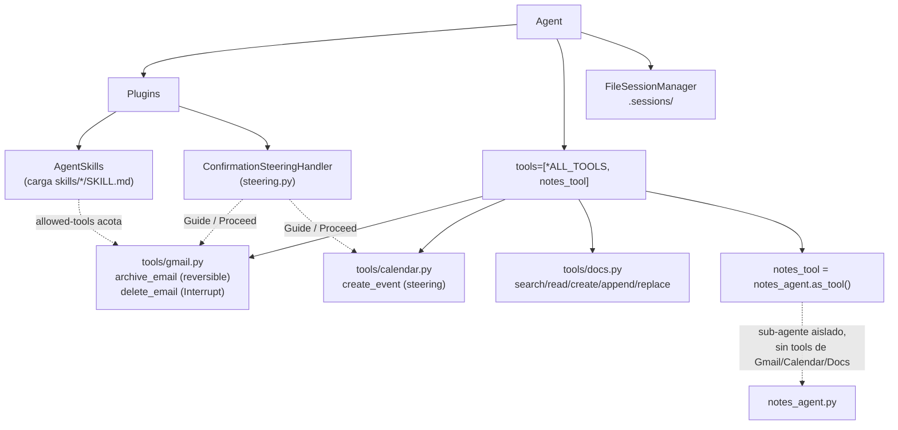
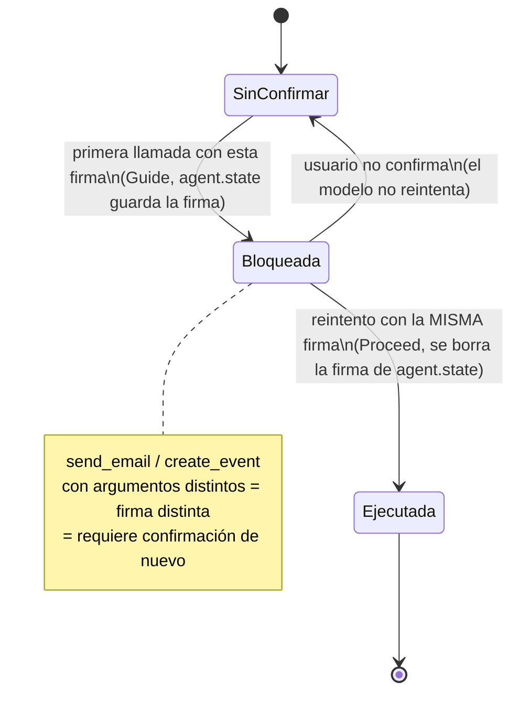
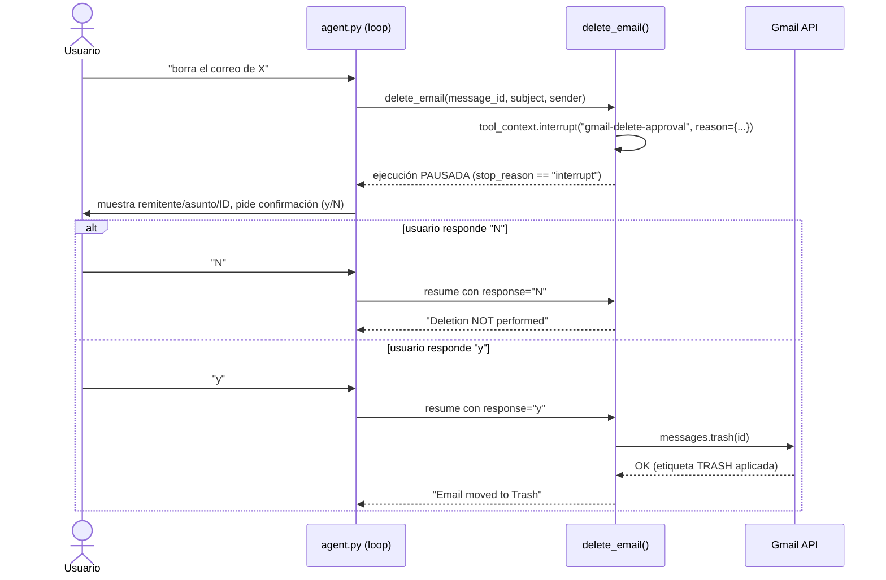

| | |
|:---|---:|
| AWS Community Day Bolivia 2026 | Powered by [Kiro](https://kiro.dev) |

---

# 05 - Harness avanzado (Skills, Interrupts, Steering, memoria persistente)

## Objetivo

Este es el paso donde el agente pasa de "funcional" a "seguro para uso
diario sin supervisión constante". Agrega siete técnicas sobre el chatbot
del paso 04: Skills (AgentSkills.io), Interrupts (confirmación humana
dura), Steering (confirmación forzada en código para riesgo moderado),
Agent-as-tool (sub-agente de notas), diseño de herramientas por nivel de
riesgo (`archive_email` vs `delete_email`), `allowed-tools` por skill, y
memoria persistente en disco (`FileSessionManager`). Ver el detalle técnico
completo, con pruebas end-to-end de cada técnica, en
[`TECNICAS_AVANZADAS.md`](../05-agente-advanced-harness/TECNICAS_AVANZADAS.md).

## Arquitectura

```
agent.py
  FileSessionManager(session_id="personal-assistant-cli", storage_dir=".sessions/")
  Agent(
    tools=[*ALL_TOOLS, notes_tool],
    plugins=[AgentSkills(skills="skills/"), ConfirmationSteeringHandler()],
    session_manager=session_manager,
  )

steering.py
  ConfirmationSteeringHandler.steer_before_tool()
    tool en {send_email, create_event} y firma nueva  -> Guide (bloquea, pide confirmar)
    tool en {send_email, create_event} y firma repetida -> Proceed (ya confirmado)
    cualquier otro tool                                -> Proceed

tools/gmail.py
  archive_email()   # reversible, sin gate
  delete_email(tool_context, ...)   # tool_context.interrupt("gmail-delete-approval", reason={...})
                                     # pausa la ejecución hasta respuesta humana real

notes_agent.py
  notes_agent = Agent(...)   # sin acceso a ninguna tool de Gmail/Calendar/Docs
  notes_tool = notes_agent.as_tool()   # delegación para estructurar notas

skills/
  weekly-billing-summary/SKILL.md   # allowed-tools: solo lectura
  inbox-cleanup-scan/SKILL.md       # allowed-tools incluye archive/delete, pero requiere selección explícita del usuario primero

logging_config.py
  configure_logging()   # logger centralizado, .logs/agent.log
```



**Steering** — máquina de estados por firma de llamada (tool + argumentos
exactos), guardada en `agent.state`:



**Interrupt duro** (`delete_email`) — a diferencia de steering, detiene la
ejecución de verdad esperando una respuesta humana síncrona:



## Controles de IA y herramientas de apoyo

- **Controles de IA (el corazón de este paso):**
  - **Interrupt duro** en `delete_email` — la ejecución se detiene de
    verdad esperando una respuesta humana síncrona; el modelo no puede
    "decidir saltárselo".
  - **Steering** en `send_email`/`create_event` — el primer intento con
    una firma (tool + argumentos) nueva es bloqueado en código
    (`Guide`); solo un reintento idéntico tras la confirmación del
    usuario procede (`Proceed`).
  - **Diseño por nivel de riesgo** — `archive_email` (reversible, sin
    gate) vs `delete_email` (irreversible, con Interrupt) como dos
    herramientas separadas, en vez de una sola "eliminar" de alto riesgo
    para toda tarea de limpieza.
  - **`allowed-tools` por skill** — cada `SKILL.md` declara qué
    herramientas son razonables usar durante esa tarea, documentando (no
    solo forzando) la intención de "solo lectura" o "requiere selección
    humana antes de actuar".
  - **Aislamiento del sub-agente de notas** — `notes_agent` no recibe
    ningún `tools=` propio, por lo que no puede enviar correos, borrar
    nada ni modificar documentos aunque se le delegue contenido sensible.
- **Herramientas de apoyo:**
  - Kiro Skill [`add-confirmation-gate`](../05-agente-advanced-harness/.kiro/skills/add-confirmation-gate/SKILL.md) —
    tabla de decisión steering-vs-Interrupt para cualquier herramienta
    nueva que agregues en pasos futuros.
  - Kiro Skill [`add-agent-skill`](../05-agente-advanced-harness/.kiro/skills/add-agent-skill/SKILL.md) —
    cómo redactar un nuevo `SKILL.md` (AgentSkills.io, distinto de las
    Kiro Skills de `.kiro/skills/`) siguiendo el patrón de los dos
    existentes.

## Cómo aprobar este nivel

📁 Directorio: `05-agente-advanced-harness/`

```bash
uv sync
uv run pytest -v          # 62 tests: steering, delete_email interrupt, tools, notes_agent
```

Pruebas manuales recomendadas (ver `TECNICAS_AVANZADAS.md` para el detalle
completo de cada una, ya verificadas en este repo):
1. Pedir enviar un correo → confirmar que la primera llamada es bloqueada
   (`Guide`) y que solo tras responder "sí" se envía realmente.
2. Pedir borrar un correo → confirmar que responde `N` NO lo borra, y que
   responder `y` sí lo mueve a Trash.
3. Cerrar la terminal con una confirmación de borrado pendiente, y volver
   a abrir el CLI → confirmar que el Interrupt pendiente se recupera desde
   `.sessions/` y se puede resolver en el nuevo proceso.

Criterio de aprobación: `uv run pytest -v` pasa (62/62), y al menos las
pruebas manuales 1 y 2 se verifican una vez contra las APIs reales antes
de considerar el harness de seguridad confiable.

