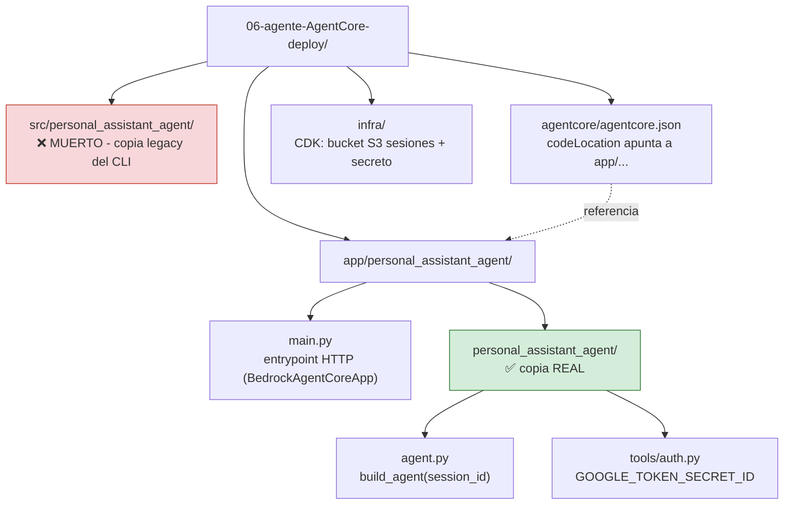
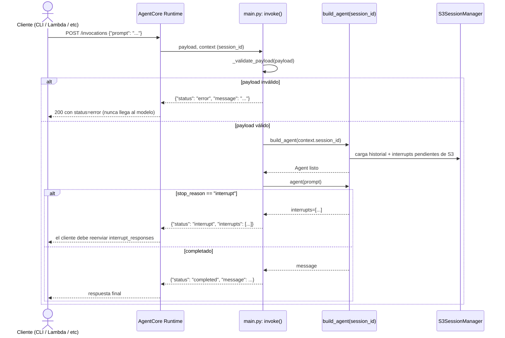

| | |
|:---|---:|
| AWS Community Day Bolivia 2026 | Powered by [Kiro](https://kiro.dev) |

---

# 06 - Despliegue en Amazon Bedrock AgentCore Runtime

## Objetivo

Tomar el agente del paso 05 (Gmail/Calendar/Docs, skills, steering,
interrupts, session manager, logging) y desplegarlo como un servicio HTTP
en **Amazon Bedrock AgentCore Runtime**, usando el CLI `@aws/agentcore`.
Esto requiere adaptar tres suposiciones del chatbot de terminal que dejan
de ser ciertas en un contenedor efímero sin terminal ni navegador: sesiones
por invocación (no un proceso de larga duración), confirmaciones sobre
HTTP (no `input()`), y autenticación de Google sin navegador (Secrets
Manager en vez de `token.json` en disco). Ver el detalle completo de cada
adaptación en [`DEPLOY_AGENTCORE.md`](../06-agente-AgentCore-deploy/DEPLOY_AGENTCORE.md).

## Arquitectura

⚠️ **Este directorio tiene DOS copias del paquete del agente** — solo una
está viva:

```
06-agente-AgentCore-deploy/
├── src/personal_assistant_agent/              # MUERTO — copia legacy del CLI, no se usa
├── app/personal_assistant_agent/
│   ├── main.py                                 # entrypoint HTTP (BedrockAgentCoreApp)
│   └── personal_assistant_agent/               # copia REAL, referenciada por agentcore.json
│       ├── agent.py    # build_agent(session_id) -> Agent nuevo por invocación
│       └── tools/auth.py   # GOOGLE_TOKEN_SECRET_ID -> Secrets Manager en vez de token.json
├── agentcore/agentcore.json, aws-targets.json   # config declarativa del CLI
├── agentcore-cli-tools/                         # @aws/agentcore instalado localmente (no global)
└── infra/                                       # CDK Python: bucket S3 de sesiones + secreto placeholder
```



Flujo de una invocación HTTP contra el runtime desplegado:



`build_agent(session_id)` elige `FileSessionManager` (local, sin
`AGENT_SESSIONS_BUCKET`) o `S3SessionManager` (desplegado, con
`AGENT_SESSIONS_BUCKET` configurado) — el disco del contenedor no es
duradero, así que producción siempre usa S3.

## Controles de IA y herramientas de apoyo

- **Controles de IA:** los mismos del paso 05 (steering, interrupt de
  `delete_email`) siguen aplicando sin cambios — la adaptación fue solo en
  la capa de invocación/persistencia, no en el comportamiento del agente.
  Se agregó además **validación de payload** (`_validate_payload()` en
  `main.py`): un `prompt` no-string o un `interrupt_responses` malformado
  se rechaza con `{"status": "error", ...}` antes de siquiera construir el
  agente, en vez de fallar con una excepción no controlada dentro de la
  invocación HTTP.
- **Herramientas de apoyo:**
  - Kiro Skill [`agentcore-deploy-cycle`](../06-agente-AgentCore-deploy/.kiro/skills/agentcore-deploy-cycle/SKILL.md) —
    el loop `validate → deploy → status → invoke → logs`, y una advertencia
    explícita sobre la trampa de las dos copias del paquete (editar
    `src/` no tiene ningún efecto en el agente desplegado).
  - Kiro Skill [`rotate-google-token-secret`](../06-agente-AgentCore-deploy/.kiro/skills/rotate-google-token-secret/SKILL.md) —
    cómo rotar el token de Google en Secrets Manager sin redesplegar el
    agente.
  - `Justfile` (`just deploy`, `just status`, `just invoke "..."`, `just logs`,
    `just infra-deploy`, etc.) — atajos para el CLI de AgentCore y el CDK
    de prerrequisitos.

## Cómo aprobar este nivel

📁 Directorio: `06-agente-AgentCore-deploy/`

Requisito previo: Node.js 20+, acceso a Bedrock habilitado, `token.json`
local válido de los pasos anteriores.

```bash
# 1. Tests de la copia real del agente (su propio venv)
cd app/personal_assistant_agent && uv run pytest -v   # 36 tests
cd ../..

# 2. CLI + infra de prerrequisitos (ver DEPLOY_AGENTCORE.md para el detalle paso a paso)
cd agentcore-cli-tools && npm install && cd ..
cd infra && uv sync && npm install && npx cdk deploy && cd ..
aws secretsmanager put-secret-value --secret-id <secreto-del-paso-anterior> --secret-string file://token.json

# 3. Desplegar y verificar
./agentcore-cli-tools/node_modules/.bin/agentcore validate
./agentcore-cli-tools/node_modules/.bin/agentcore deploy --target default --yes
./agentcore-cli-tools/node_modules/.bin/agentcore status
./agentcore-cli-tools/node_modules/.bin/agentcore invoke "Hola"
```

O con el `Justfile`: `just agent-sync`, `just infra-deploy`, `just deploy`,
`just status`, `just invoke "Hola"`.

Criterio de aprobación: los 36 tests pasan, `agentcore status` muestra el
runtime en estado activo, y `agentcore invoke "Hola"` devuelve una
respuesta real del agente desplegado (no un error de credenciales o de
permisos). Guarda el ARN del runtime (`agentcore status --json | jq -r
'.resources[0].identifier'`) — lo necesitan los pasos 07 y 08.

