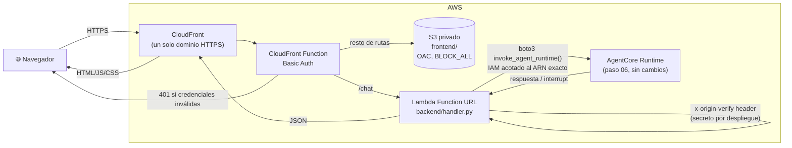
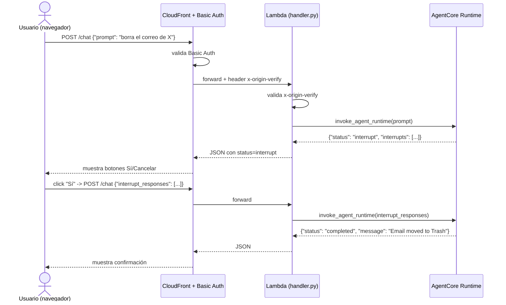

| | |
|:---|---:|
| AWS Community Day Bolivia 2026 | Powered by [Kiro](https://kiro.dev) |

---

# 07 - Interfaz web (chat en el navegador)

## Objetivo

Agregar un cliente de chat web para el agente ya desplegado en el paso 06,
sin reimplementarlo ni volver a desplegarlo. Es una capa delgada: un proxy
Lambda que reenvía cada mensaje del navegador al AgentCore Runtime vía
`boto3.invoke_agent_runtime` (el mismo mecanismo que usa `agentcore
invoke`, pero accesible desde un navegador), más un frontend estático con
manejo de interrupciones en pantalla (botones Sí/Cancelar para
confirmaciones como `delete_email`).

## Arquitectura



- Un solo dominio HTTPS evita CORS y evita que el navegador necesite
  credenciales de AWS — toda llamada a
  `bedrock-agentcore:InvokeAgentRuntime` la hace la Lambda, con su propio
  rol de IAM (permiso acotado al ARN exacto del runtime, sin wildcard).
- La Function URL de la Lambda no usa OAC+`AWS_IAM` (el enfoque
  "recomendado") porque el flujo de firma SigV4 de CloudFront para POST
  resultó poco confiable en pruebas — en su lugar, un header secreto
  (`x-origin-verify`) generado por CDK en cada despliegue, que solo
  CloudFront conoce e inyecta.
- Basic Auth (usuario/contraseña) protege toda la distribución vía
  CloudFront Function — control ligero de una sola credencial compartida,
  no autenticación por usuario real.

Secuencia de un mensaje de chat, incluida una interrupción resuelta desde
los botones Sí/Cancelar del frontend:



## Controles de IA y herramientas de apoyo

- **Controles de IA:** ninguno nuevo — este paso no toca el agente ni sus
  gates de steering/interrupt; el frontend simplemente sabe mostrar
  botones Sí/Cancelar cuando la respuesta del backend trae
  `"status": "interrupt"`, reflejando el mismo mecanismo del paso 05/06.
- **Controles de acceso (no de IA, de infraestructura):** Basic Auth en
  CloudFront (credencial única, ver limitación explícita en el README de
  este paso), header secreto `x-origin-verify` entre CloudFront y la
  Lambda, bucket S3 sin acceso público (`BLOCK_ALL` + OAC).
- **Herramientas de apoyo:**
  - Kiro Skill [`cdk-iterate-and-verify`](../07-agente-Web-Interface/.kiro/skills/cdk-iterate-and-verify/SKILL.md) —
    el loop de desarrollo local (backend + frontend sin desplegar nada) y
    el ciclo `diff`/`deploy`/`destroy` de CDK, incluida la recuperación de
    las credenciales de Basic Auth desde los outputs del stack.
  - `Justfile` (`just local`, `just infra-deploy <arn>`, `just outputs`,
    `just logs <function-name>`).

## Cómo aprobar este nivel

📁 Directorio: `07-agente-Web-Interface/`

Requisito previo: el agente del paso 06 ya desplegado, con su ARN de
runtime a mano.

```bash
uv sync
uv run pytest -v          # 11 tests: agent_client, handler (mockeados, sin AWS real)

# Desarrollo local (opcional, antes de desplegar)
export AGENT_RUNTIME_ARN=<arn-del-paso-06>
cd backend && uv run python local_server.py   # http://127.0.0.1:8000

# Despliegue
cd infra && uv sync && npm install
npx cdk deploy -c agentRuntimeArn=<arn-del-paso-06> --require-approval never
```

O con el `Justfile`: `just sync`, `just local`, `just infra-deploy <arn>`.

Criterio de aprobación: los 11 tests pasan, y al abrir la
`DistributionDomainName` impresa por `cdk deploy` (con las credenciales de
Basic Auth también impresas), el chat responde correctamente contra el
agente real, incluyendo al menos una interrupción resuelta desde los
botones en pantalla (p. ej. pedir borrar un correo y confirmar).

