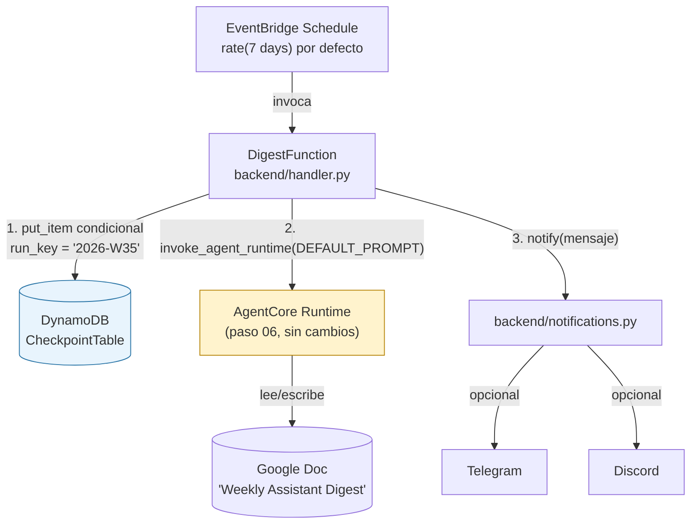
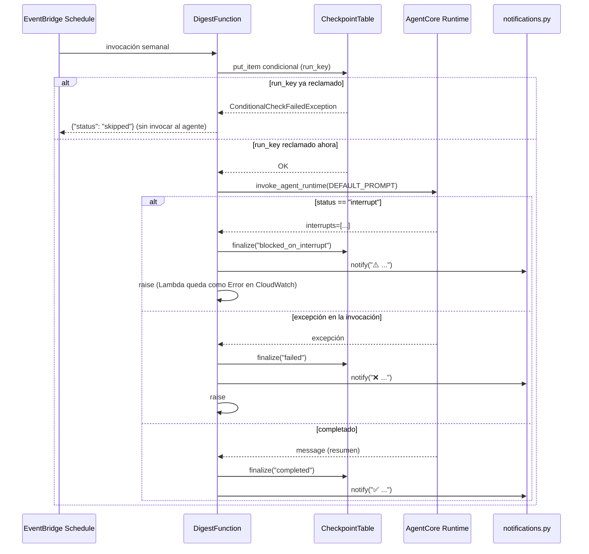
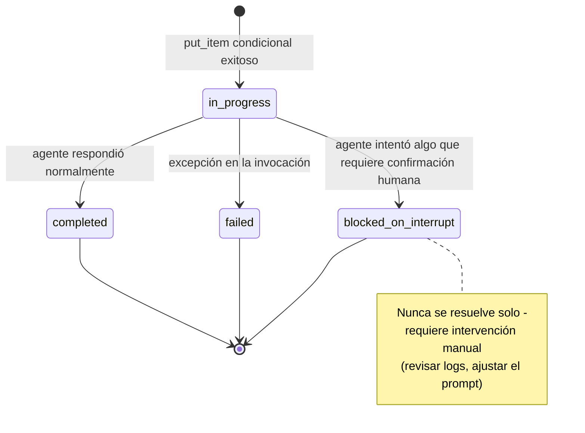

| | |
|:---|---:|
| AWS Community Day Bolivia 2026 | Powered by [Kiro](https://kiro.dev) |

---

# 08 - Agente autónomo (ejecución programada, sin disparador humano)

## Objetivo

Agregar una capa de autonomía sobre el agente ya desplegado en el paso 06:
una vez por semana, una Lambda invoca al agente con una instrucción fija
(ejecutar la skill `weekly-billing-summary` y guardar el resultado en un
Google Doc), sin que nadie escriba un prompt. No reimplementa el agente ni
crea uno nuevo — es un disparador (EventBridge Scheduler) y una capa de
idempotencia (DynamoDB) alrededor del mismo agente del paso 06, más
notificaciones push opcionales (Telegram/Discord) para saber qué pasó sin
revisar CloudWatch Logs.

## Arquitectura





Estados posibles de un `run_key` en `CheckpointTable`:



`DEFAULT_PROMPT` instruye explícitamente no enviar correos, no crear
eventos, no borrar/archivar nada — solo herramientas de lectura
(`list_recent_emails`, `get_email`) y Docs sin steering (`search_docs`,
`create_doc`, `append_to_doc`).

## Controles de IA y herramientas de apoyo

- **Controles de IA:** este paso no agrega ningún gate nuevo — depende
  completamente de los que ya existen desde el paso 05:
  - Si el modelo alguna vez intentara `send_email`/`create_event`, el
    steering lo bloquearía (`Guide`) y, como no hay humano que responda
    en una invocación programada, simplemente queda sin confirmar — nunca
    se ejecuta.
  - Si intentara `delete_email`, el Interrupt se dispara y también queda
    sin resolver por la misma razón.
  - El handler detecta explícitamente el caso `status == "interrupt"` y
    hace **fallar la invocación de Lambda a propósito** (visible en la
    métrica `Errors` de CloudWatch) en vez de dejarlo colgado
    silenciosamente.
  - **Idempotencia como control de integridad**: el checkpoint condicional
    en DynamoDB evita que un reintento de EventBridge/Lambda duplique una
    sección en el digest o invoque al agente dos veces para la misma
    semana.
- **Herramientas de apoyo:**
  - Kiro Skill [`idempotent-scheduled-lambda`](../08-agente-Autonomo/.kiro/skills/idempotent-scheduled-lambda/SKILL.md) —
    el patrón de checkpoint condicional en DynamoDB, reutilizable para
    cualquier tarea autónoma futura más allá del digest semanal.
  - Kiro Skill [`add-notification-channel`](../08-agente-Autonomo/.kiro/skills/add-notification-channel/SKILL.md) —
    cómo configurar Telegram/Discord, verificarlos con `curl` antes de
    desplegar, y cómo agregar un canal nuevo siguiendo el mismo patrón
    (nunca lanza excepción, nunca bloquea el resultado del digest).
  - `Justfile` (`just infra-deploy <arn> ...`, `just invoke <function-name>`,
    `just logs <function-name>`).

## Cómo aprobar este nivel

📁 Directorio: `08-agente-Autonomo/`

Requisito previo: el agente del paso 06 ya desplegado, con su ARN de
runtime a mano.

```bash
uv sync
uv run pytest -v          # 18 tests: checkpoint, handler (todos los outcomes), notifications

cd infra && uv sync && npm install
npx cdk deploy -c agentRuntimeArn=<arn-del-paso-06> --require-approval never
# opcional: agrega -c telegramBotToken=... -c telegramChatId=... y/o -c discordWebhookUrl=...
```

O con el `Justfile`: `just infra-deploy <arn> [schedule] [telegram-token] [chat-id] [discord-url]`.

Prueba manual (no esperar al horario semanal):
```bash
aws lambda invoke --function-name <DigestFunctionName-del-output> \
  --region us-east-1 --cli-binary-format raw-in-base64-out /tmp/out.json && cat /tmp/out.json
```

Criterio de aprobación: los 18 tests pasan, el `cdk deploy` termina sin
error, y el `aws lambda invoke` manual devuelve `{"status": "completed", ...}`
con una nueva sección fechada visible en el Google Doc "Weekly Assistant
Digest" — y, si configuraste notificaciones, un mensaje ✅ llega a
Telegram/Discord segundos después.

