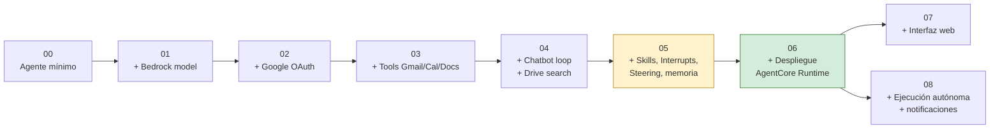
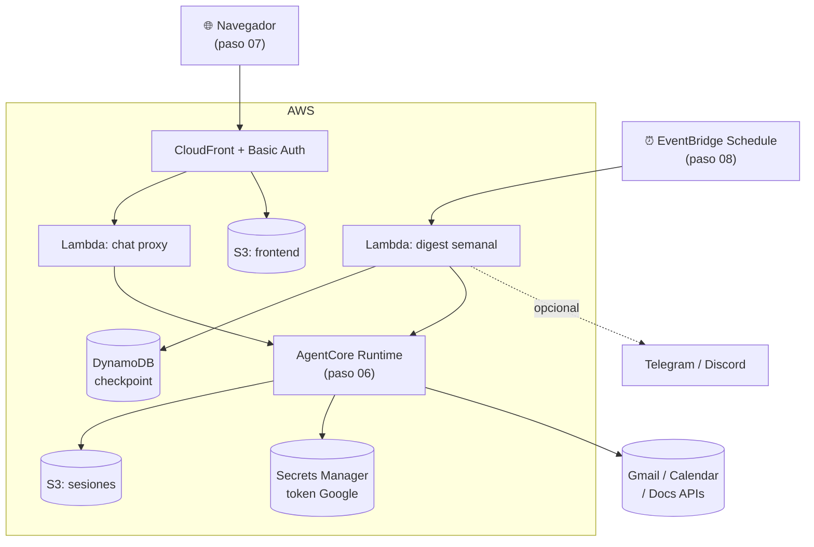

| | |
|:---|---:|
| AWS Community Day Bolivia 2026 | Powered by [Kiro](https://kiro.dev) |

---

# Docs

Un documento por paso (`00` a `08`), cada uno respondiendo lo mismo en el
mismo orden:

1. **Objetivo** — qué agrega este paso sobre el anterior y por qué.
2. **Arquitectura** — piezas nuevas y cómo se conectan (cuando aplica; los
   primeros pasos no tienen arquitectura propia que documentar más allá del
   código).
3. **Controles de IA y herramientas de apoyo** — qué mecanismos de
   seguridad/control sobre el agente introduce este paso (steering,
   interrupts, políticas, etc.) y qué herramientas de desarrollo (Kiro
   Skills, Justfile, hooks) están disponibles para trabajar en él.
4. **Cómo aprobar este nivel** — la secuencia exacta de comandos para dejar
   el paso funcionando y verificado, antes de pasar al siguiente.

Estos documentos son una vista consolidada — no reemplazan el `README.md`
de cada paso (que tiene el detalle completo de configuración de Google
OAuth, troubleshooting, etc.), sino que dan el mapa general y enlazan al
README cuando hace falta el detalle.

| Documento | Paso |
|---|---|
| [00-proyecto-base.md](./00-proyecto-base.md) | Agente mínimo, sin herramientas |
| [01-agente-basico.md](./01-agente-basico.md) | Modelo Bedrock + system prompt |
| [02-agente-email-conf.md](./02-agente-email-conf.md) | Autenticación Google OAuth |
| [03-agente-impl-tools.md](./03-agente-impl-tools.md) | Herramientas Gmail/Calendar/Docs |
| [04-agente-impl-chatbot.md](./04-agente-impl-chatbot.md) | Chatbot interactivo + búsqueda en Drive |
| [05-agente-advanced-harness.md](./05-agente-advanced-harness.md) | Skills, Interrupts, Steering, memoria persistente |
| [06-agente-AgentCore-deploy.md](./06-agente-AgentCore-deploy.md) | Despliegue en Amazon Bedrock AgentCore Runtime |
| [07-agente-Web-Interface.md](./07-agente-Web-Interface.md) | Interfaz web de chat |
| [08-agente-Autonomo.md](./08-agente-Autonomo.md) | Ejecución autónoma programada + notificaciones |

## Panorama general

Progresión de capacidades a través de los 9 pasos (cada documento tiene el
diagrama detallado de su propio paso):

Los pasos 07 y 08 son independientes entre sí — ambos construyen sobre el
agente desplegado en 06, pero no dependen uno del otro.

Vista de la arquitectura final en la nube (una vez completados los pasos
06, 07 y 08 — todos apuntando al mismo AgentCore Runtime):

